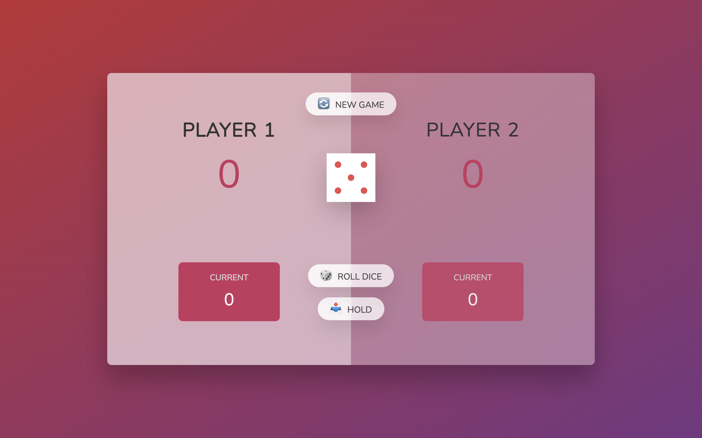

<h1 align="center">🎲 Dice Game 🏆</h1>

Dice Game is a simple game that can be played by two players. It is a game of luck. The player who scores 100 points first will win the game. It came up with a beautiful user interface so enjoy the Dice Game with your friend.

  
  

Click [here](https://rajeev-dice-game.netlify.app/) to play the game.

## Features and Interfaces

- You and your friend can play the game by clicking on the `Roll Dice` button.

- You can hold your score by clicking on the `Hold` button if you thought that next time you will get `1` at dice.

- It also provides you to reset the game by clicking on the `New Game` button.

- The player who scores 100 points first will win the game.

- It came up with a beautiful user interface so enjoy the Dice Game with your friend.

## Tech stack

#### Frontend

- JavaScript
- CSS
- HTML
- Markdown
- DOM

#### Other Tools

- VS Code
- Prettier
- Netlify
- Git

## Points to remember while testing the WebApp

1. First of all fork this [Repository](https://github.com/beRajeevKumar/Dice-Game.git) and clone it.
2. Drag the project into VS Code.
3. Click to the [Live Server](https://marketplace.visualstudio.com/items?itemName=ritwickdey.LiveServer) extension and run the `index.html` file.
4. The app is now running, Now you can test the Website.

## Useful Links

- [Project Demo](https://rajeev-dice-game.netlify.app/) for Web Version.

- [Project Repository](https://github.com/beRajeevKumar/Dice-Game.git)

## Need help?

Feel free to contact me on [Twitter](https://twitter.com/be_rajeevkumar) or [LinkedIn](https://www.linkedin.com/in/berajeevkumar/), know more about me at my [Portfolio](https://iamrajeev.me).

<h1 align=center>Happy Coding 👨‍💻</h1>
